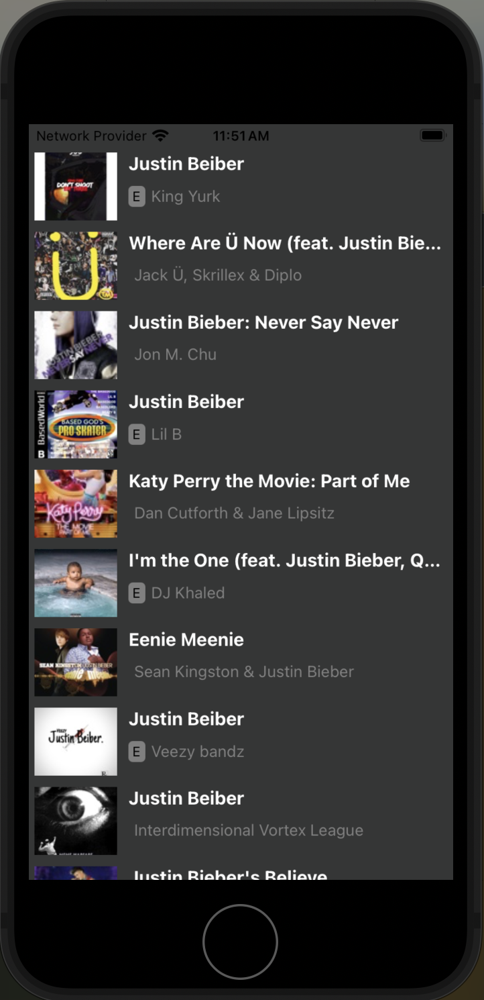
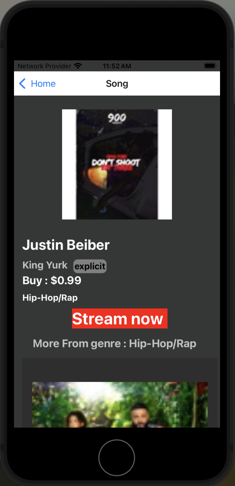

d# Songs and Recommendations App

This is a React Native application that displays a list of songs and provides song recommendations based on user preferences. The app is designed to deliver an intuitive and engaging music experience, with easy navigation and personalized suggestions.

## Features

- Display a list of popular songs.
- Provide song recommendations based on user activity.
- User-friendly interface with smooth navigation.
- Cross-platform support (iOS and Android).

## Screenshots




## Installation and Setup

Follow these steps to run the project locally:

### Prerequisites

Make sure you have the following installed:

- [Node.js](https://nodejs.org/) (v14 or later)
- [Yarn](https://yarnpkg.com/) or [npm](https://www.npmjs.com/)
- [React Native CLI](https://reactnative.dev/docs/environment-setup) or [Expo CLI](https://docs.expo.dev/get-started/installation/)

### Clone the Repository

```bash
git clone https://github.com/your-username/songs-recommendations-app.git
cd songs-recommendations-app

Step 1: Clone the Repository
git clone https://github.com/Rohitsingh777/Songapp.git
cd Music-app
Step 2: Install Dependencies

Using Yarn:
yarn install

Or using npm:
npm install

Step 3: Start the Development Server

npx expo start
This will start the Metro bundler and open the Expo Dev Tools in your browser.

Step 4: Run the App
On Physical Device
iOS/Android: Download the Expo Go app from the App Store or Google Play.
Scan the QR code from the Expo Dev Tools to open the app on your device.
On Emulator
iOS: Press i in the terminal to open the app in the iOS simulator (requires macOS).
Android: Press a in the terminal to open the app in the Android emulator.


